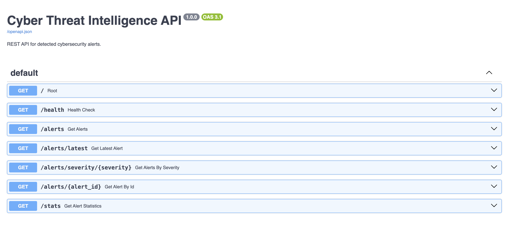
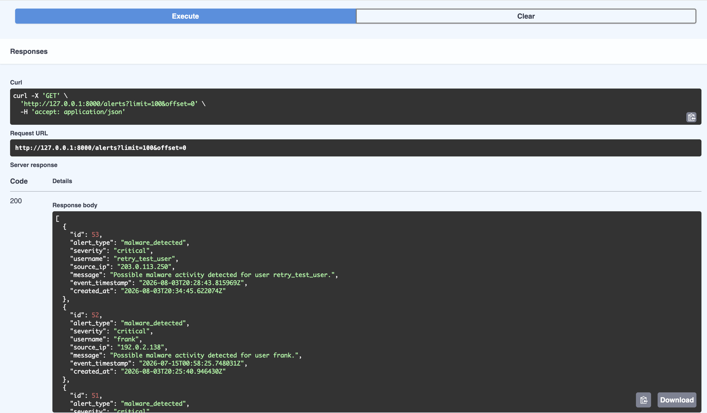
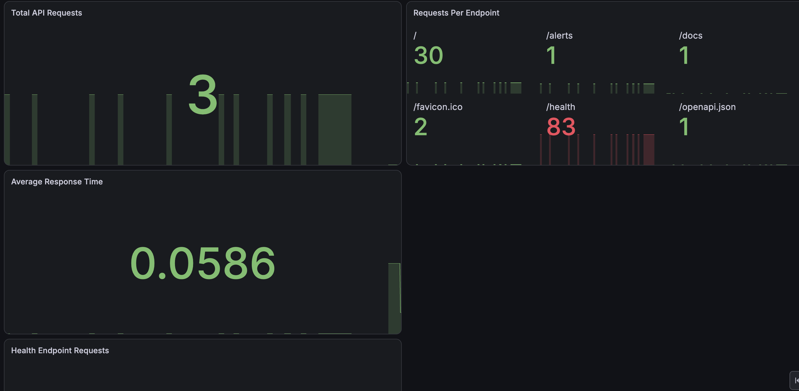
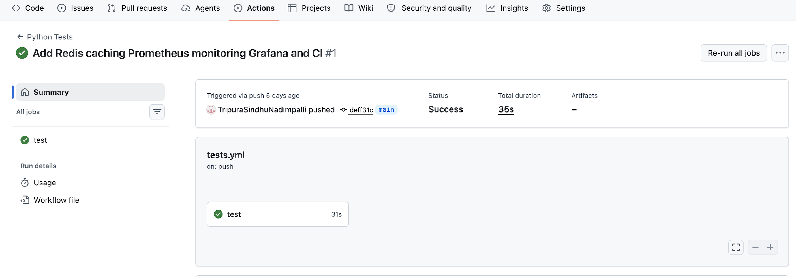

# SentinelStream – Real-Time Cyber Threat Intelligence Platform

SentinelStream is a real-time cybersecurity monitoring platform that ingests security events through Apache Kafka, detects suspicious activity, stores alerts in PostgreSQL, caches frequently accessed data in Redis, exposes REST APIs through FastAPI, and provides observability using Prometheus and Grafana.

The project is designed to demonstrate event-driven architecture, backend engineering, fault tolerance, caching, monitoring, automated testing, and CI/CD in one end-to-end system.

## Key Features

- Real-time event streaming with Apache Kafka
- Security event processing with a Kafka consumer
- Rule-based threat detection
- Malware indicator detection
- Brute-force login detection
- High-severity event detection
- PostgreSQL alert persistence
- Redis caching for API statistics
- FastAPI REST API
- Alert filtering and pagination
- Pydantic response validation
- Manual Kafka offset management
- PostgreSQL retry and recovery handling
- Structured logging
- Prometheus metrics
- Grafana monitoring dashboard
- Automated tests with Pytest
- GitHub Actions CI pipeline
- Docker Compose service orchestration

## System Architecture

```text
Security Events
      |
      v
Kafka Producer
      |
      v
Apache Kafka
      |
      v
Kafka Consumer
      |
      v
Threat Detector
      |
      +-------------------+
      |                   |
      v                   v
PostgreSQL            Redis Cache
      |
      v
FastAPI REST API
      |
      +-------------------+
      |                   |
      v                   v
Swagger UI           Prometheus
                          |
                          v
                    Grafana Dashboard


## Technology Stack

| Category | Technology |
|---|---|
| Programming Language | Python 3.12 |
| API Framework | FastAPI |
| Event Streaming | Apache Kafka |
| Database | PostgreSQL |
| Cache | Redis |
| Monitoring | Prometheus |
| Visualization | Grafana |
| Testing | Pytest |
| CI/CD | GitHub Actions |
| Containers | Docker, Docker Compose |

## Project Structure

```text
real-time-cyber-threat-intelligence/
├── api/
├── cache/
├── config/
├── consumer/
├── data/
├── database/
├── detection/
├── docs/
├── monitoring/
├── producer/
├── tests/
├── .github/workflows/
├── docker-compose.yml
├── requirements.txt
└── README.md
```

## Installation & Setup

### 1. Clone the repository

```bash
git clone https://github.com/TripuraSindhuNadimpalli/real-time-cyber-threat-intelligence.git
cd real-time-cyber-threat-intelligence
```

### 2. Create a Python environment

```bash
conda create -n cyber-pipeline python=3.12
conda activate cyber-pipeline
```

### 3. Install dependencies

```bash
pip install -r requirements.txt
```

### 4. Start Docker services

```bash
docker compose up -d
```

This starts:

- Apache Kafka
- PostgreSQL
- Redis
- Prometheus
- Grafana

### 5. Start the FastAPI server

```bash
fastapi dev api/main.py
```

The API will be available at:

```
http://127.0.0.1:8000
```

Swagger documentation:

```
http://127.0.0.1:8000/docs
```


## API Endpoints

| Method | Endpoint | Description |
|---|---|---|
| GET | `/` | Check whether the API is running |
| GET | `/health` | Check API and PostgreSQL connectivity |
| GET | `/alerts` | Retrieve security alerts with pagination and filtering |
| GET | `/alerts/latest` | Retrieve the latest security alert |
| GET | `/alerts/{alert_id}` | Retrieve a specific alert by ID |
| GET | `/alerts/severity/{severity}` | Retrieve alerts by severity |
| GET | `/stats` | Retrieve aggregated alert statistics |
| GET | `/metrics` | Expose Prometheus metrics |

### Example

```bash
curl http://127.0.0.1:8000/alerts


### Example Response

Example response from:

```http
GET /alerts
```

```json
[
  {
    "id": 53,
    "alert_type": "malware_detected",
    "severity": "critical",
    "username": "retry_test_user",
    "source_ip": "203.0.113.250",
    "message": "Possible malware activity detected for user retry_test_user.",
    "event_timestamp": "2026-08-03T20:28:43.815969Z",
    "created_at": "2026-08-03T20:34:45.622074Z"
  }
]
```


## Screenshots

### Swagger UI



---

### API Response



---

### Grafana Dashboard



---

### GitHub Actions CI

